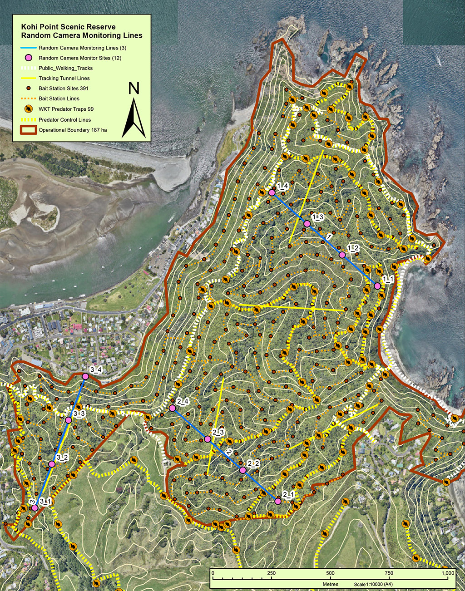
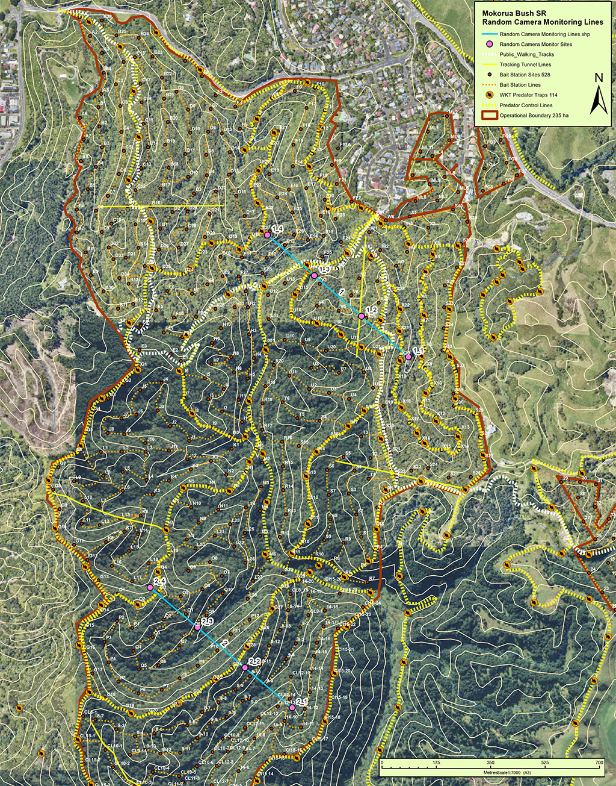
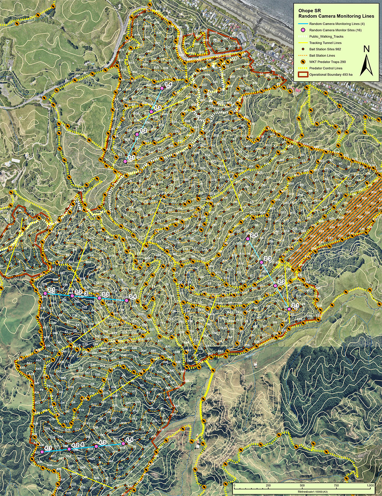
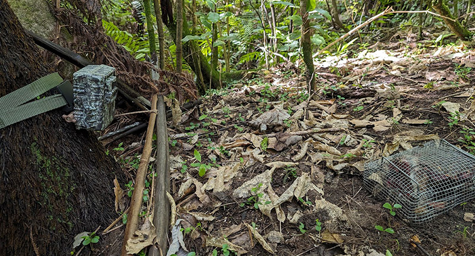

```{r setup, include=FALSE}

library(kableExtra)
library(htmltools)
library(knitr)

formatted_start_date <- format(params$dates$deployments_start_date, "%A, %d %B %Y")
formatted_end_date <- format(params$dates$deployments_end_date, "%A, %d %B %Y")
formatted_package_created_date <- format(params$dates$package_created_date, "%A, %d %B %Y at %H:%M", tz = "Pacific/Auckland")

```

```{r functions, include=FALSE, results='asis'}
generate_column_descriptions <- function(column_names) {
  column_descriptions <- params$data$column_descriptions
  
  # Start the HTML string with an opening div tag for the container
  html_output <- "<div class='column-descriptions-container'><div class='column-descriptions-heading'>Column Descriptions</div>"
  
  for (i in seq_along(column_names)) {
    column_name <- column_names[i]
    description <- column_descriptions[[column_name]]
    
    # Remove leading and trailing whitespace, and replace internal excessive whitespace which was causing render issues
    description <- gsub("\n", " ", description) # Remove new lines if not wanted
    description <- gsub("[ ]+", " ", description) # Collapse multiple spaces into one, if necessary

    # Replace <br> with a <div> that acts as a custom line break, to reduce gap size between paragraphs
    description <- gsub("<br>", "<div class='custom-line-break'></div>", description, fixed = TRUE)

    # Concatenate the description to the HTML output
    html_output <- paste0(html_output, "<div class='description-item'><strong>", column_name, ": </strong>", description, "</div>")
  }
  
  # Close the container div tag
  html_output <- paste0(html_output, "</div>")
  
  # Print the HTML content
  cat(html_output, sep = "")
}


generate_html_header <- function() {
  logo_path <- normalizePath(file.path("../../resources", params$config$meta$organisation_header_logo), mustWork = FALSE)

  html_string <- sprintf('<div class="page-break-header"><span><strong>InsightfulKiwi</strong>&nbsp;| %s - Camera Monitoring Results - %s</span></div>\n\n',
          params$config$meta$project_name,
          params$dates$deployments_period,
          logo_path)
  
  return(html_string)
}


# Not currently used
generate_description_table <- function(column_names, column_descriptions) {
  # Wrap column names in <strong> tags
  strong_column_names <- sapply(column_names, function(name) paste0("<strong>", name, "</strong>"))
  
  # Ensure that column descriptions are matched correctly to column names and are not escaped, allowing HTML content
  descriptions <- sapply(column_names, function(name) column_descriptions[[name]], simplify = TRUE, USE.NAMES = FALSE)
  
  # Create a clean data frame with just the intended columns
  description_df <- data.frame(
    "Column Name" = strong_column_names,
    "Description" = descriptions,
    stringsAsFactors = FALSE
  )
  
  # Explicitly avoid row names in the data frame for clean output
 # rownames(description_df) <- NULL
  
  # Use kable to generate a two-column table, apply styling with kableExtra, and set an ID for the table
  kable_output <- kable(description_df, format = "html", col.names = c("Column Name", "Description"), 
                        align = c('l', 'l'), row.names = FALSE, escape = FALSE, 
                        table.attr = paste0("id=column_descriptions_table")) %>%
    kable_styling(bootstrap_options = c("striped", "hover", "condensed", "responsive")) %>%
        column_spec(column = 1, extra_css = "white-space: nowrap;") # don't wrap first column
  
  return(kable_output)
}


```


<!--
```{r debug }
#str(params$data)
```
-->


<!-- Page header and page break for printing -->
```{r, echo=FALSE, results='asis'}
  cat(generate_html_header())
```

# Executive Summary

This `r params$config$meta$project_name` report relates to data collected during the <strong>`r params$dates$deployments_period`</strong> deployment selection period.

## Background

The Whakatane Kiwi Trust (WKT) has established a comprehensive camera monitoring network across three key operational areas in Whakatāne and Ōhope. This initiative is designed to assess the impact of pest control measures, focusing on stoats, other mustelids, rats, and feral cats.

The network features strategically placed camera monitoring lines within Kohi Point Scenic Reserve (three lines), Mokorua Bush Scenic Reserve (two lines), and Ōhope Scenic Reserve (four lines). Each line has four camera locations, defined by latitude and longitude coordinates, spaced 200 meters apart.

Seasonal monitoring is conducted once per season in winter, spring, summer, and autumn, with each monitoring session lasting 21 nights. This methodical approach enables consistent year-round data collection, facilitating comparisons with data from previous years and other camera monitoring projects following the same protocols.

The data from these deployments underpin comprehensive reports, revealing trends in targeted species populations and the effectiveness of pest control measures. These insights allow WKT and its partners to evaluate impact, address identified issues, and refine future strategies for improved outcomes.

Our deployment strategy and subsequent analysis follow a well-defined methodology. Consult the ‘Methodology’ appendix (attached) for details.

<strong>For further information, contact:</strong><br>
Gaye Payze, Predator Control Coordinator, Whakatane Kiwi Trust, <a href="mailto: whakakiwi6@gmail.com?subject=WKT%20camera%20monitoring%20network">whakakiwi6@gmail.com</a>.

## Introduction
This report was generated by InsightfulKiwi based on a data package from the `r params$config$meta$project_name`, created on <strong>`r formatted_package_created_date`</strong>.  

The data package includes all deployment and observation records from the camera monitoring network. InsightfulKiwi automatically analyses this data for the specified deployment period, generating summaries, statistics, and visualisations, all compiled into this comprehensive report.

The deployment period for this report is <strong>`r params$dates$deployments_period`</strong>, covering deployments from <strong>`r formatted_start_date`</strong>, to <strong>`r formatted_end_date`</strong> at 23:59:59.

<strong>For more information about InsightfulKiwi, contact:</strong><br>
Blair George, Ake Technology Ltd, <a href="mailto:blair@aketechnology.co.nz?subject=Insightful%20Kiwi%20-%20WKT%20report">blair@aketechnology.co.nz</a>.

<!-- Page header and page break for printing -->
```{r, echo=FALSE, results='asis'}
  cat(generate_html_header())
```


```{r locality_species_mean_rai_showing_class, results='asis', echo=FALSE}
# Extract the data, caption, and potentially other necessary information
data_item <- params$data$spp_summary$locality_species_mean_rai_showing_class

# Don't wrap first column
column_spec <- list(
  list(column = 1, extra_css = "white-space: nowrap;")
)

setup_kable_output(table_id = "locality_species_mean_rai_showing_class",
                   data = data_item,
                   table_type = "short",
                   column_spec = column_spec,
                   heading_level = "##"
                   )

generate_column_descriptions(c("Species Class", "RAI ± SE"))

```

<!-- Page header and page break for printing -->
```{r, echo=FALSE, results='asis'}
  cat(generate_html_header())
```


```{r network_spp_summary, results='asis', echo=FALSE}
# Extract the data, caption, and potentially other necessary information
data_item <- params$data$spp_summary$network

# Don't wrap first column
column_spec <- list(
  list(column = 1, extra_css = "white-space: nowrap;")
)

setup_kable_output(table_id = "network_spp_summary",
                   data = data_item,
                   table_type = "long",
                   column_spec = column_spec,
                   heading_level = "##"
                   )

generate_column_descriptions(c("Total Individuals", "Dup Count", "Net Count"))
```

<!-- Page header and page break for printing -->
```{r, echo=FALSE, results='asis'}
  cat(generate_html_header())
```

## Daily count heatmaps

```{r plots, results='asis', echo=FALSE}

for(locality in names(params$data$plots)) {
 # cat(sprintf("## %s {.rotated-heading}\n", species_name))
  cat(sprintf("### %s\n", locality))
#  heading <- paste(species_name, " density heatmap")
#  cat('###', heading, '\n')
#    cat('### Density heatmap\n')
  # Use HTML  tag to embed the image
  cat(sprintf('', params$data$plots[[locality]], locality), '<br>\n')
  
  # Page header and page break for printing
  cat(generate_html_header())
}


```

# Results Summary, by Locality

This section shows summary results grouped by Locality. The final row of each table showing overall aggregate data has been calculated based on the data across the entire the deployment selection period, it is not just an aggregation of the result shown for each Locality. This ensures aggregate mean and percentage calculations are accurate.

```{r locality_deployments_overview, results='asis', echo=FALSE}
# Extract the data, caption, and potentially other necessary information
data_item <- params$data$summary_data$locality

# Don't wrap first column
column_spec <- list(
  list(column = 1, extra_css = "white-space: nowrap;")
)

setup_kable_output(table_id = "locality_deployments_overview",
                   data = data_item,
                   table_type = "short",
                   column_spec = column_spec,
                   heading_level = "##"
                   )

generate_column_descriptions(c("Camera Hours", "Animal Detections", "Mean Detection Interval"))
```


```{r locality_observations_overview, results='asis', echo=FALSE}
# Extract the data, caption, and potentially other necessary information
data_item <- params$data$summary_data$locality

# Don't wrap first column
column_spec <- list(
  list(column = 1, extra_css = "white-space: nowrap;") #,
#  list(column = 4, extra_css = "width: 15%;"),
#  list(column = 5, extra_css = "width: 15%;"),
#  list(column = 6, extra_css = "width: 15%;"),
#  list(column = 7, extra_css = "width: 15%;")
)

setup_kable_output(table_id = "locality_observations_overview",
                   data = data_item,
                   table_type = "short",
                   column_spec = column_spec,
                   heading_level = "##"
                   )
generate_column_descriptions(c("Unique Species"))
```


<!-- Page header and page break for printing -->
```{r, echo=FALSE, results='asis'}
  cat(generate_html_header())
```


```{r locality_spp_summary, results='asis', echo=FALSE}
# Extract the data, caption, and potentially other necessary information
data_item <- params$data$spp_summary$locality

# Don't wrap first column
column_spec <- list(
  list(column = 1, extra_css = "white-space: nowrap;"),
  list(column = 2, extra_css = "white-space: nowrap;"),
#  list(column = 3, extra_css = "width: 14%;"),
#  list(column = 4, extra_css = "width: 14%;"),
#  list(column = 5, extra_css = "width: 14%;"),
#  list(column = 6, extra_css = "width: 14%; "),
  list(column = 7, extra_css = "white-space: nowrap;")
)


#num_columns <- ncol(output_data$table_data)
## Calculate even width percentage for columns except the first
#even_width_percentage <- 100 / (num_columns - 1)  # Divide 100% by the number of columns minus one

## Generate column_spec for columns 2 through the last, applying even width
#additional_specs <- lapply(2:num_columns, function(column_index) {
#  extra_css <- sprintf("width: %.2f%%;", even_width_percentage)
#  list(column = column_index, extra_css = extra_css)
#})
#
## Append the additional_specs to the existing column_spec
#column_spec <- c(column_spec, additional_specs)

setup_kable_output(table_id = "locality_spp_summary",
                   data = data_item,
                   table_type = "long",
                   column_spec = column_spec,
                   heading_level = "##"
                   )
```


<!-- Page header and page break for printing -->
```{r, echo=FALSE, results='asis'}
  cat(generate_html_header())
```

# Density maps: important species
Each species density map has its own scale for the number of individuals; they are not directly comparable.

```{r density_maps, results='asis', echo=FALSE}

species_name_type <- params$config$globals$species_name_type # "scientificName" or "vernacularNames.eng"

for(species_name in names(params$data$density_maps)) {
 # cat(sprintf("## %s {.rotated-heading}\n", species_name))
  cat(sprintf("## %s\n", species_name))
#  heading <- paste(species_name, " density heatmap")
#  cat('###', heading, '\n')
#    cat('### Density heatmap\n')
  # Use HTML  tag to embed the image
  cat(sprintf('', params$data$density_maps[[species_name]], species_name), '<br>\n')
  
 # heading <- paste(species_name, " observations by Locality")
#  cat('###', heading, '\n')
    
  # Filter the data based on species_name_type
  filtered_data <- params$data$spp_summary$line %>%
    filter(tolower(!!sym(species_name_type)) == tolower(species_name))
  
  column_spec <- list(
    list(column = 1, extra_css = "white-space: nowrap;"),
    list(column = 3, extra_css = "white-space: nowrap;")
  )
  # Generate and include the table after the image
  setup_kable_output(table_id = "line_spp_summary",
                     data = filtered_data,
                     table_type = "data-only",
                     column_spec = column_spec,
                     heading_level = NULL)
  
  # Page header and page break for printing
  cat(generate_html_header())
}


```

# Appendix: Results Summary, by Line
This section shows summary results grouped by Line within each Locality. For aggregated figures combining all Lines in each Locality, refer to the Locality view of the data.


```{r line_deployments_overview, results='asis', echo=FALSE}
# Extract the data, caption, and potentially other necessary information
data_item <- params$data$summary_data$line

# Don't wrap first column
column_spec <- list(
  list(column = 1, extra_css = "white-space: nowrap;")
)

setup_kable_output(table_id = "line_deployments_overview",
                   data = data_item,
                   table_type = "short",
                   column_spec = column_spec,
                   heading_level = "##"
                   )
```


```{r line_observations_overview, results='asis', echo=FALSE}
# Extract the data, caption, and potentially other necessary information
data_item <- params$data$summary_data$line

# Don't wrap first column
column_spec <- list(
  list(column = 1, extra_css = "white-space: nowrap;")
)

setup_kable_output(table_id = "line_observations_overview",
                   data = data_item,
                   table_type = "short",
                   column_spec = column_spec,
                   heading_level = "##"
                   )
```

<!-- Page header and page break for printing -->
```{r, echo=FALSE, results='asis'}
  cat(generate_html_header())
```


```{r line_spp_summary, results='asis', echo=FALSE}
# Extract the data, caption, and potentially other necessary information
data_item <- params$data$spp_summary$line

# Don't wrap first column
column_spec <- list(
  list(column = 1, extra_css = "white-space: nowrap;"),
  list(column = 3, extra_css = "white-space: nowrap;")
)


#num_columns <- ncol(output_data$table_data)
## Calculate even width percentage for columns except the first
#even_width_percentage <- 100 / (num_columns - 1)  # Divide 100% by the number of columns minus one

## Generate column_spec for columns 2 through the last, applying even width
#additional_specs <- lapply(2:num_columns, function(column_index) {
#  extra_css <- sprintf("width: %.2f%%;", even_width_percentage)
#  list(column = column_index, extra_css = extra_css)
#})
#
## Append the additional_specs to the existing column_spec
#column_spec <- c(column_spec, additional_specs)

setup_kable_output(table_id = "line_spp_summary",
                   data = data_item,
                   table_type = "long",
                   column_spec = column_spec,
                   heading_level = "##"
                   )
```

<!-- Page header and page break for printing -->
```{r, echo=FALSE, results='asis'}
  cat(generate_html_header())
```

# Appendix: Results Summary, by Location

This section shows summary results grouped by Location, the least summarised form of the data shown in this report. For aggregated figures combining all Locations on a Line, refer to the Line view of the data.


```{r location_deployments_overview, results='asis', echo=FALSE}
# Extract the data, caption, and potentially other necessary information
data_item <- params$data$summary_data$location

# Don't wrap first column
column_spec <- list(
  list(column = 1, extra_css = "white-space: nowrap;")
)

setup_kable_output(table_id = "location_deployments_overview",
                   data = data_item,
                   table_type = "long",
                   column_spec = column_spec,
                   heading_level = "##"
                   )
```


```{r location_observations_overview, results='asis', echo=FALSE}
# Extract the data, caption, and potentially other necessary information
data_item <- params$data$summary_data$location

# Don't wrap first column
column_spec <- list(
  list(column = 1, extra_css = "white-space: nowrap;")
)

setup_kable_output(table_id = "location_observations_overview",
                   data = data_item,
                   table_type = "long",
                   column_spec = column_spec,
                   heading_level = "##"
                   )
```

<!-- Page header and page break for printing -->
```{r, echo=FALSE, results='asis'}
  cat(generate_html_header())
```

```{r location_spp_summary, results='asis', echo=FALSE}
# Extract the data, caption, and potentially other necessary information
data_item <- params$data$spp_summary$location

# Don't wrap first column
column_spec <- list(
  list(column = 1, extra_css = "white-space: nowrap;"),
  list(column = 4, extra_css = "white-space: nowrap;")
)


#num_columns <- ncol(output_data$table_data)
## Calculate even width percentage for columns except the first
#even_width_percentage <- 100 / (num_columns - 1)  # Divide 100% by the number of columns minus one

## Generate column_spec for columns 2 through the last, applying even width
#additional_specs <- lapply(2:num_columns, function(column_index) {
#  extra_css <- sprintf("width: %.2f%%;", even_width_percentage)
#  list(column = column_index, extra_css = extra_css)
#})
#
## Append the additional_specs to the existing column_spec
#column_spec <- c(column_spec, additional_specs)

setup_kable_output(table_id = "location_spp_summary",
                   data = data_item,
                   table_type = "long",
                   column_spec = column_spec,
                   heading_level = "##"
                   )
```

<!-- Page header and page break for printing -->
```{r, echo=FALSE, results='asis'}
  cat(generate_html_header())
```

# Appendix: Deployments list
<div class="caption">Table showing deployments included in the deployment selection. Sorted by start date, the order in which they were deployed.</div>
```{r network_deployments_browse, results='asis', echo=FALSE}
# Extract the data, caption, and potentially other necessary information
data_item <- params$data$deployments

setup_kable_output(table_id = "network_deployments_browse",
                   data = data_item,
                   table_type = "data-only",
                   column_spec = column_spec,
                   heading_level = "#"
                   )
```


<!-- Page header and page break for printing -->
```{r, echo=FALSE, results='asis'}
  cat(generate_html_header())
```

# Appendix: Methodology

## Sampling and deployment methodology
Our sampling and deployment methodology is an implementation of the standard protocols being developed by Craig Gillies and set out in Interim DOC trail camera guide v1.1.1: Using camera traps to monitor feral cats, mustelids and rats (PDF, March 2023, Craig Gillies, Department of Conservation). 

Following these standards will provide an index of the relative abundance of stoats and other species in the Whakatāne and Ōhope Scenic Reserves that will be directly comparable to other sites adhering to the same protocols.

### Camera monitoring lines
Camera monitoring lines have been defined for the Kohi Point Scenic Reserve (KP), Mokorua Bush Scenic Reserve (MK) and Ōhope Scenic Reserve (OH). Maps showing the location of the monitoring lines are contained in the pages following.

These lines are randomly oriented and were intended to be spaced at least 1 km apart. However, lines two and three within the Kohi Point Scenic Reserve converge to within 500 meters of each other at their northern ends. This is due to the small size and awkward shape of the reserve, and our desire to include a line in the "Hillcrest Triangle" area of the reserve, which is a potential hotspot for predators. All other lines maintain a minimum separation distance of 1 km from each other.

Each line comprises four camera locations, spaced 200 meters apart. The specific location of each camera is defined by latitude and longitude coordinates, and labelled according to its general area (KP, MK, or OH), line number (1 – 4), and camera number within the line (1 – 4), e.g. KP 1_3 refers to camera 3 on line 1 of the monitoring line situated within the Kohi Point Scenic Reserve.

```{r locality_camera_monitoring_network_overview, results='asis', echo=FALSE}
# Extract the data, caption, and potentially other necessary information
data_item <- params$data$camera_network_overview

# Don't wrap first column
column_spec <- list(
  list(column = 1, extra_css = "white-space: nowrap;")
)

setup_kable_output(table_id = "locality_camera_monitoring_network_overview",
                   data = data_item,
                   table_type = "short",
                   column_spec = column_spec,
                   heading_level = "###"
                   )

generate_column_descriptions(c("Coverage Area (ha)", "Camera Density (per hectare)", "Mean Location Pair Spacing", "Location Pair Exceptions"))
```

<!-- Page header and page break for printing -->
```{r, echo=FALSE, results='asis'}
  cat(generate_html_header())
```

#### Kohi Point Scenic Reserve Map - Camera Monitoring Lines (teal blue), Rodent monitoring (yellow)

<figcaption>Source: Gaye Payze, Whakatane Kiwi Trust</figcaption>
</figure>

<!-- Page header and page break for printing -->
```{r, echo=FALSE, results='asis'}
  cat(generate_html_header())
```

#### Mokoroa Bush Scenic Reserve Map - Camera Monitoring Lines (teal blue), Rodent monitoring (yellow)

<figcaption>Source: Gaye Payze, Whakatane Kiwi Trust</figcaption>
</figure>

<!-- Page header and page break for printing -->
```{r, echo=FALSE, results='asis'}
  cat(generate_html_header())
```

#### Ohope Scenic Reserve Map - Camera Monitoring Lines (teal blue), Rodent monitoring (yellow)

<figcaption>Source: Gaye Payze, Whakatane Kiwi Trust</figcaption>
</figure>

<!-- Page header and page break for printing -->
```{r, echo=FALSE, results='asis'}
  cat(generate_html_header())
```


### Camera preparation and settings
Before being deployed in the field, a series of pre-deployment checks and configurations are performed on each camera.

The cameras are configured to utilise motion detection, capturing three photos per motion detection event, and then enter a five-minute dormant phase before motion detection is re-enabled. Additionally, various settings, including the date and time, are meticulously verified and updated as necessary. The accuracy of these date and time settings is critical for our subsequent sequencing and classification processes.

We use a combination of Browning BTC-6DCL and Browning BTC-5PXD trail cameras. Both models have dedicated nighttime sensors and an image preview screen. The particular settings we use for these cameras are shown in the table below.

<table class="table short">
  <thead>
    <tr>
      <th>Setting</th>
      <th>Value</th>
      <th>Note</th>
    </tr>
  </thead>
  <tbody>
    <tr>
      <td>Date</td>
      <td>mm/dd/yyyy</td>
      <td>US-format date with month first</td>
    </tr>
    <tr>
      <td>Time</td>
      <td>Current time AM/PM</td>
      <td>Set to exact local time at start of deployment</td>
    </tr>
    <tr>
      <td>Mode</td>
      <td>Trail</td>
      <td></td>
    </tr>
    <tr>
      <td>Capture delay</td>
      <td>5Min</td>
      <td>Sleep for 5 minutes after detection is triggered</td>
    </tr>
    <tr>
      <td>PicSize</td>
      <td>Low[4MP]</td>
      <td>Any higher uses upsampling, no quality gain</td>
    </tr>
    <tr>
      <td>MultiShot</td>
      <td>RPF-3Shot</td>
      <td>Rapid fire, 3 images in < 1 second (per detection)</td>
    </tr>
    <tr>
      <td>Cap Start</td>
      <td>12:00 AM</td>
      <td>Capture 24 hours a day</td>
    </tr>
    <tr>
      <td>Cap End</td>
      <td>12:00 AM</td>
      <td>Capture 24 hours a day</td>
    </tr>
    <tr>
      <td>Smart IR</td>
      <td>On</td>
      <td></td>
    </tr>
    <tr>
      <td>Night Exp</td>
      <td>Fast Motion</td>
      <td></td>
    </tr>
    <tr>
      <td>Temp Unit</td>
      <td>C</td>
      <td></td>
    </tr>
    <tr>
      <td>Info Strip</td>
      <td>On</td>
      <td></td>
    </tr>
    <tr>
      <td>SD Management</td>
      <td>Off</td>
    </tr>
    <tr>
      <td>Motion Detect</td>
      <td>Normal</td>
      <td></td>
    </tr>
    <tr>
      <td>Name</td>
      <td>e.g. TRAILCAMD5</td>
      <td>Unique identifier for camera</td>
    </tr>
  </tbody>
</table>


Once all the camera checks are successfully completed, the SD memory card is erased to ensure that it contains no residual images, and the camera is ready for deployment.

<strong>The principal investigator is responsible for camera preparation and settings.</strong>

<!-- Page header and page break for printing -->
```{r, echo=FALSE, results='asis'}
  cat(generate_html_header())
```

### Camera deployment to the field
Cameras are securely affixed, either to suitable existing trees or to wooden stakes firmly embedded in the ground. 

The camera is centered on and positioned relative to a lure basket. Camera lens height is 40 to 60 cm above the basket, at a distance of 70 to 100 cm away. These ranges allow for straightforward placement on slopes, without needing to measure angles. Where practicable, cameras are aligned in a southern direction (140 to 220 degrees) to minimise exposure to direct sunlight.

The lure is contained within a mesh basket (17mm mesh), with a fine mesh cover (6mm mesh), anchored to the ground with two wide U-shaped pegs. The lure used is bait of fresh rabbit as a base, with a layer of Erayz on top.
<figure>

<figcaption>Example camera deployment in the field</figcaption>
</figure>
Once setup is complete and checked, the location identifier and associated camera name is recorded, then the camera's menu is used to manually trigger a detection, resulting in three images. The timestamp on these images will be recorded as the deployment start date. Finally, the camera's weather tight door is securely fastened.

<strong>The field work team lead assigned to the location for deployment is responsible for ensuring camera deployment is carried out in accordance with our methodology.</strong>

Once a camera has been deployed to a location, it is left undisturbed. The next visit is to retrieve the camera at the completion of the 21-night deployment period. On retrieval, we trigger motion detection before powering the camera off. The timestamp on these final images becomes the deployment end date.


## Observation methodology
Images captured by each camera are uploaded and stored as distinct deployments, categorised by the location identifier for the location the camera was deployed to. Within each deployment, images are arranged based on detection events, resulting in numerous sequences, each comprising three images. Each set of three images undergoes a comprehensive assessment by an individual reviewer, who diligently records their observations against the sequence. In cases of uncertainty, the reviewer annotates the observation accordingly. 

Additionally, a sequence can be classified as "unknown," indicating the presence of an object or creature whose species is known to the reviewer, or as "blank," signifying a detection unrelated to animals e.g., movement of foliage or shadows as a result of wind.

<!-- Page header and page break for printing -->
```{r, echo=FALSE, results='asis'}
  cat(generate_html_header())
```


### Secondary review and validation
All observations pertaining to unknown sequences, blank sequences and uncertain findings, are subjected to a secondary review by a different evaluator. Any contentious determinations are referred to the relevant taxonomic expert. 

This observation methodology accommodates the participation of individuals with less taxonomic knowledge of animal species in the process, reserving the involvement of subject matter experts primarily for cases that are contentious or of significant importance, which occur relatively infrequently.

After concluding the observation process, a duplicate of the data is extracted for the purpose of subsequent analysis. This duplicate is referred to as a data package.

<strong>The principal investigator assumes ultimate responsibility for ensuring the execution of the sampling and deployment methodology and observation methodology, and therefore for the accuracy of the source data.</strong>


## Data analysis
The data package adheres to a format defined by Camera Trap Data Package (Camtrap DP). The data package contents serve as the foundation for all findings and computations presented in this report. We import the package into InsightfulKiwi, an application purpose-written to analyse 'Camtrap DP' data packages in alignment with our methodology. InsightfulKiwi performs analysis and generates visual representations.


### InsightfulKiwi configuration options
InsightfulKiwi has configuration options that determine reporting output. Many of those settings are explained in the relevant section of the report, for example named species classes and the possible duplicate threshold. The following settings relate to the entire report and have not been explained elsewhere.

<strong>Species consolidations</strong><br>
InsightfulKiwi can be configured to consolidate observations of multiple species into one, to provide more meaningful reporting output based on the requirements of the project. In this report:

```{r spp_consol_defs, results='asis', echo=FALSE}
conslidations_report <- get_spp_consol_details(config$globals$spp_consol_defs)
cat('<em>', conslidations_report, '</em>', sep = "\n")
```

<strong>Species exclusions</strong><br>
All species observations should be recorded for posterity, ensuring that blank detection counts are accurate. However, it can be beneficial to exclude observations of certain species from the reporting if it detracts from the information sought. 

In this report, any observations of these species have been filtered out and will not appear nor be counted as an Animal observation:
```{r global_species_exclusions, results='asis', echo=FALSE}
if (!is.null(config$globals$global_species_exclusions)) {
  global_species_exclusions <- paste(config$globals$global_species_exclusions, collapse = ", ")
  cat('<em>', global_species_exclusions, '</em>', sep = "\n")
} else {
  cat('<em>No species observations have been excluded.</em>')
}
```

<strong>Species output name type</strong><br>
InsightfulKiwi can be configured to output based on the scientific name, or common (vernacular) name. This report has been generated with output type: <em>`r paste(params$config$globals$species_name_type)`</em>

## Reporting
The culmination of all previous efforts relating to the preparation, deployment, observations and analysis is this report. 

All data and visualisations you see in this report have been created directly from the raw observation and deployment records in the data package, with no human interaction. The report itself has been automatically generated based on a template. This ensures the report is as accurate as the execution of our data collection and annotation processes allows. It is uniform, easily repeatable, and free from mistakes that can occur with manual methods.

<!-- Page header and page break for printing -->
```{r, echo=FALSE, results='asis'}
  cat(generate_html_header())
```

# Appendix: Acknowledgements

## Camera monitoring network

The Whakatane Kiwi Trusts' monitoring network and methodology was established by Gaye Payze, Hilary Sheaff, Tom Armstrong and Blair George based on advice and information from Craig Gillies (DOC).<br>

<strong>Ongoing fieldwork and observations</strong><br>
Thanks to: Hilary Sheaff, Gaye Payze, Tom Armstrong, Blair George, Rob Franklin, Tom Franklin and Luke McIvor.

## Support and funding
<ul>
<li>General thanks to <a href="https://www.whakatanekiwi.org.nz/get-involved/sponsors/">WKT sponsors</a> and <a href="https://www.whakatanekiwi.org.nz/get-involved/volunteer/">WKT volunteers</a></li>
<li>Special thanks to the <a href="https://mylotto.co.nz/about-us">New Zealand Lotteries Commission</a> for funding equipment used in the camera monitoring network.</li>
</ul>

## Systems and data
We use <a href="https://agouti.eu/">Agouti</a>: <em>AI powered solutions for wildlife camera-trapping projects</em> to record and annotate raw data.

<em>Note: InsightfulKiwi are working with Agouti to develop AI detection of endemic New Zealand species, starting with Weka and Northern brown kiwi. This is not in place at the date of this report.</em>

This report and all analysis was generated by InsightfulKiwi</a>: an R ShinyApp to analyse and visualise Camera Trap Data Packages. InsightfulKiwi was developed by Blair George, Ake Technology Ltd, <a href="mailto:blair@aketechnology.co.nz?subject=Insightful%20Kiwi%20-%20WKT%20report">blair@aketechnology.co.nz</a> to be aligned with the methodology set out in this report. InsightfulKiwi uses <a href="https://inbo.github.io/camtraptor/">camtraptor</a> to read the raw Camera Trap Data Package.

Interoperability between software packages is straightforward thanks to <a href="https://camtrap-dp.tdwg.org/">Camera Trap Data Package</a>: <em>a community developed data exchange format for camera trap data</em>.

Any Whakatane Aerodrome rainfall observations were provided by MetService.
